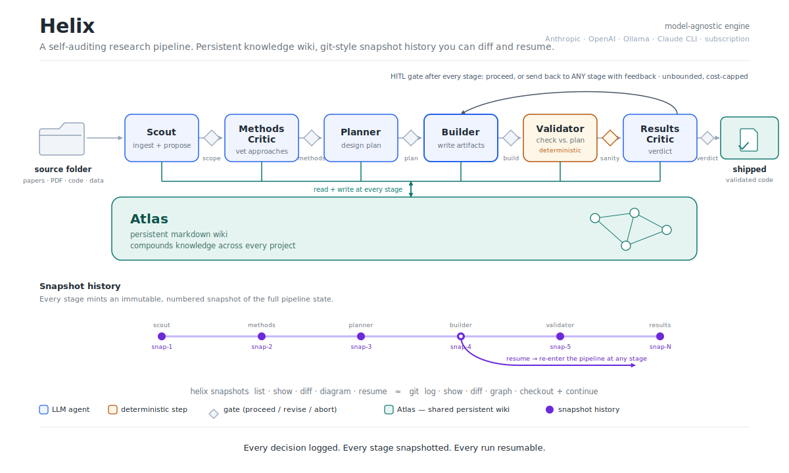

# Helix

Helix turns a folder of source material into validated, contextualized code,
with a human checkpoint after every step. You review each stage, send work
back to any earlier stage with a note, or let it run unattended. Every step is
a git-style snapshot you can diff, branch, and resume, and a persistent wiki
carries what it learns from one project into the next.

It runs on your Claude subscription through Claude Code — no API key, no
service to host.

<p align="center">
  
</p>

## Use Helix from Claude Code

This is the primary way to use Helix. Set up a project, open it in Claude
Code, and tell it to start.

```bash
helix init my-research && cd my-research

claude setup-token                                   # one-time
printf 'CLAUDE_CODE_OAUTH_TOKEN=%s\n' "<paste token>" > .helix/.env && chmod 600 .helix/.env

# add your sources (PDF, markdown, code, data) and edit question.md, then:
claude                                               # open Claude Code here
```

`helix init` scaffolds a `CLAUDE.md` that tells Claude Code how to drive the
pipeline. From there you work in plain language:

```
you>   start helix
helix> 6 files in this folder (3 PDF, 2 .md, 1 .csv). Use all of them?
you>   yes, and the question in question.md is right
helix> Scout proposed 2 approaches; I recommend #1 (larger eval set).
       Proceed, send back, or stop?
you>   proceed
helix> Methods Critic: the eval corpus is too narrow. Proceed / send back?
you>   send it back to Scout — restrict to the 2024 papers only
helix> Re-ran Scout with that note. Planner is done. Proceed?
you>   from here run autonomously until the validator
helix> ...
```

The agent stops at every stage with a short report and waits for you. "Send
it back to the planner, the bands are too loose" re-enters that stage with
your feedback attached. "Run autonomously until the builder" hands over
control up to that point. Nothing is lost: each stage and each send-back is
snapshotted, so you can later ask it to diff, branch, or resume any point.

## Run it directly

The chat layer is optional. `helix run` is the same pipeline without it, and
is what the agent calls under the hood:

```bash
helix run .
```

It pauses after each stage and prints a report:

```
── gate after planner ──
  decision : Plan: CFD cardiac model
  rationale: Designed validation plan with success criteria
[p]roceed / [g]o back to a stage / [s]top:
```

`p` proceeds, `g` sends the run back to any stage with feedback (unlimited —
there is no iteration cap), `s` stops. `--autonomous-until <stage>` and
`--auto` skip the prompts. No Claude subscription? `helix setup` configures an
API key, or `helix run . --local` uses Ollama offline.

## What you get

- **Control without micromanagement.** A gate after every stage. Proceed,
  redirect to any earlier stage with feedback, or stop — or delegate a span
  with `--autonomous-until`.
- **A record you can trust.** Every stage and send-back is an immutable,
  content-addressed snapshot. Diff, branch, revert, or resume from any point.
  Snapshots cost no LLM calls.
- **Knowledge that compounds.** The Atlas wiki persists across projects;
  every stage reads and writes it.
- **No infrastructure.** The default engine is Claude Code itself, so there
  is no API key and nothing to deploy. The same pipeline also runs as a
  LangGraph graph (`helix[sdk]`) for programmatic use.

## Install

| Command | Adds |
|---|---|
| `pip install -e .` | CLI mode. Dependency-light: `click`, `python-dotenv`, `pyyaml`. |
| `pip install -e '.[sdk]'` | LangGraph orchestrator and the litellm API path. |
| `pip install -e '.[agent]'` | `helix agent` (Claude Agent SDK). |
| `pip install -e '.[pdf]'` | PDF ingestion. |

## Command reference

```bash
helix run .                                   # review after every stage (default)
helix run . --autonomous-until builder        # auto until a stage, then ask
helix run . --auto                            # fully autonomous
helix run . --engine sdk                      # same pipeline, LangGraph runner
helix snapshots list | show | diff | diagram <project>
helix snapshots resume my-research 5 --at planner --branch retry
helix snapshots revert my-research 5          # restore that snapshot's files
helix agent show the timeline for my-research # conversational, gated tools
helix status | helix log <project> | helix atlas search <query>
```

## Documentation

| Doc | Read it for |
|---|---|
| [docs/usage.md](docs/usage.md) | Driving Helix from Claude Code or the CLI |
| [docs/architecture.md](docs/architecture.md) | How the pieces fit (with diagrams) |
| [docs/snapshots.md](docs/snapshots.md) | The git-style snapshot model |
| [docs/agents.md](docs/agents.md) | Editing or adding an agent |
| [REFACTOR.md](REFACTOR.md) | What changed from helix-mini |

## Develop

```bash
pip install -e '.[sdk,dev]'
pytest -q          # 19 passed, including dual-orchestrator conformance
```
