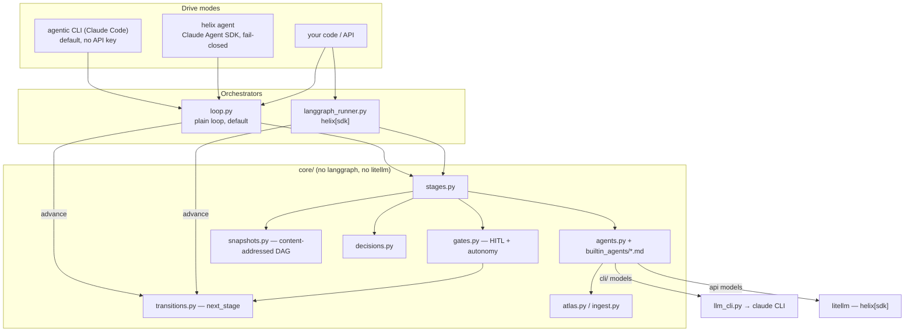
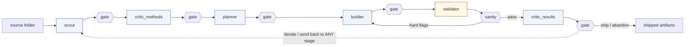

# Architecture

## The mental model

Helix has three layers, from the inside out:

1. **The core** (`helix/core/`) is the pipeline itself: the stages, the gate
   logic, the routing, the Atlas wiki, and snapshots. It is pure Python and
   imports neither `langgraph` nor `litellm`.
2. **An orchestrator** runs the core. There are two, and they are
   interchangeable: a plain loop (the default) and a LangGraph graph (the
   `helix[sdk]` extra).
3. **A drive mode** invokes an orchestrator: an agentic CLI, the `helix
   agent` command, or your own code.

The key design rule: both orchestrators step the pipeline through one shared
function (`loop.advance`), which routes through one resolver
(`core.transitions.next_stage`). They cannot disagree about what runs next.
`tests/test_conformance.py` runs the same scenario through both and asserts
the results are identical.

## Layers



## Pipeline flow



A gate runs after every stage. You can proceed, send the run back to any
earlier stage with a note, or stop. The note is stored in
`state.human_feedback` and injected into that stage's prompt when it re-runs.
`validator` is deterministic and calls no LLM; a hard band violation routes
back to `builder` automatically, carrying the flags as feedback.

## Autonomy and the cost ceiling

Autonomy is a single value, `autonomy_until`:

- empty: ask at every gate (the default)
- a stage name: auto-proceed the gates before that stage, then ask
- `END`: fully autonomous

It can change on every run, including a resume.

Cycling is unbounded by design. The only limit is a cost and call ceiling in
`helix.toml [limits]`. When a run reaches it, Helix does not crash. In an
interactive run it asks whether to continue (which doubles the ceiling) or
stop. In an autonomous run it takes a snapshot, stops, and prints the resume
command.

## Snapshots

Helix takes a snapshot after every stage and every send-back. A snapshot is a
deterministic serialization of state plus the decision text the stage already
produced, so it costs no LLM calls. Artifact bytes are content-addressed under
`.helix/snapshots/<project>/objects/`, stored once per hash, so a snapshot
stays a few kilobytes even after hundreds of cycles. Each snapshot records its
`parent` and `branch`, so the history is a real DAG: list, show, diff,
diagram, revert, and resume from any point (branch by resuming with
`--branch`). See [snapshots.md](snapshots.md).

## Storage layout

```
<project>/                 # the current directory, or $HELIX_HOME
├── helix.toml             # [atlas].path, [limits], [default]/[lightspeed], [cli.*]
├── .helix/
│   ├── .env               # CLAUDE_CODE_OAUTH_TOKEN or API keys
│   └── snapshots/<proj>/  # <id>.json, index.json, objects/<sha>
├── atlas/                 # the persistent wiki (path is configurable)
│   ├── index.md  log.md  sources/  concepts/  entities/
│   └── projects/<proj>/   # overview.md, decisions.md, timeline.md,
│       └── artifacts/     #   sandbox-confined generated code
├── agents/<stage>.md      # optional per-project agent overrides
└── raw/<proj>/            # immutable copies of the ingested input
```

## Invariants

- Nothing in `helix/core/` or `orchestrator/loop.py` imports `langgraph` or
  `litellm` at module load.
- All routing lives in `core/transitions.py`. Both orchestrators go through
  `loop.advance`.
- A snapshot never calls an LLM.
- LLM output reaches disk only through `sandbox.sanitize_atlas_writes` and
  `sanitize_code_artifacts`.
- Auth precedence is OAuth-first. The `helix agent` tool gate is fail-closed.
