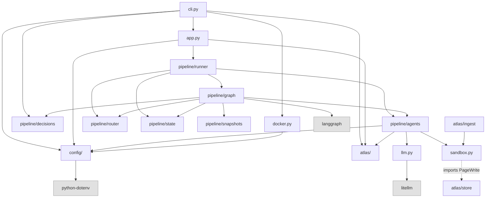

# Architecture

## System Summary

Helix Mini is a Python CLI tool that runs research pipelines over input folders of source material (papers, code, data). Each folder is processed through six LLM-powered agents — scout, critic, planner, builder, validator, and critic-results — orchestrated as a 12-node [LangGraph](https://github.com/langchain-ai/langgraph) state graph. Every agent reads from and writes to a shared **Atlas**, a persistent markdown wiki at `~/.helix-mini/atlas/` that accumulates knowledge across projects. LLM calls go through [litellm](https://github.com/BerriAI/litellm) for provider-agnostic routing to Anthropic, OpenAI, or local Ollama models. The system records a full audit trail of decisions and state snapshots for every pipeline run.

---

## Component Inventory

| Component | Path | Responsibility | Key Dependencies |
|-----------|------|----------------|------------------|
| **config/settings** | `src/helix_mini/config/settings.py` | `HELIX_HOME` path resolution, `.env` file loading, `config.toml` creation | python-dotenv, tomllib |
| **config/models** | `src/helix_mini/config/models.py` | `ModelConfig` dataclass with per-stage model selection, Qwen size mappings | config/settings |
| **config/providers** | `src/helix_mini/config/providers.py` | Provider registry (`PROVIDERS` dict), API key detection and validation | litellm (lazy) |
| **atlas/store** | `src/helix_mini/atlas/store.py` | `Atlas` class — read, write, keyword search over markdown wiki; `Page` and `PageWrite` dataclasses | threading (stdlib) |
| **atlas/ingest** | `src/helix_mini/atlas/ingest.py` | `ingest_folder()` — reads files from input, copies to `raw/`, returns as `Page` objects; PDF extraction | sandbox, pymupdf (optional) |
| **pipeline/state** | `src/helix_mini/pipeline/state.py` | `ForgeState` dataclass (19 fields), `GraphState` TypedDict for LangGraph, `to_state()` converter | — |
| **pipeline/agents** | `src/helix_mini/pipeline/agents.py` | `Agents` class with 6 agent methods and system prompt constants | atlas, llm, sandbox, config |
| **pipeline/graph** | `src/helix_mini/pipeline/graph.py` | `build_graph()` — 12-node LangGraph `StateGraph` with conditional routing | langgraph |
| **pipeline/router** | `src/helix_mini/pipeline/router.py` | `gate_decision()`, `sanity_route()`, `make_autonomy()` — pure decision rules, no LLM | pipeline/state |
| **pipeline/runner** | `src/helix_mini/pipeline/runner.py` | `run_project()` (single folder) and `run_parallel()` (multi-folder via asyncio) | pipeline/graph, atlas, config |
| **pipeline/decisions** | `src/helix_mini/pipeline/decisions.py` | `append_decision()`, `render_decisions_md()`, `save_decisions_md()` — audit log | — |
| **pipeline/snapshots** | `src/helix_mini/pipeline/snapshots.py` | `mint_snapshot()`, `load_snapshot()`, `list_snapshots()` — state checkpoints | — |
| **sandbox** | `src/helix_mini/sandbox.py` | Validates all LLM-generated file writes — path traversal, content size, batch limits | atlas.store.PageWrite |
| **llm** | `src/helix_mini/llm.py` | `call_llm()` and `call_llm_json()` — thin litellm wrapper with timeout, retries, JSON parsing | litellm |
| **docker** | `src/helix_mini/docker.py` | `run_sandboxed()` — builds and runs Docker container with security hardening | subprocess, config |
| **app** | `src/helix_mini/app.py` | `HelixMini` facade — wires Atlas + config + pipeline runner | atlas, config, pipeline/runner |
| **cli** | `src/helix_mini/cli.py` | Click CLI: `run`, `setup`, `init`, `status`, `log`, `atlas search` | click, app, atlas, config |

---

## Data Flow

### Operation 1: `helix-mini run ./folder --lightspeed`

This is the primary workflow — running a full research pipeline on a folder of source material.

1. **CLI** (`cli.py:run`) resolves folder paths, creates `ModelConfig.load(lightspeed=True)` which selects the cheaper model (Claude Haiku), and instantiates `HelixMini`.
2. **HelixMini** (`app.py`) initializes Atlas at `~/.helix-mini/atlas/`, calls `ensure_config()` to create `config.toml` if absent, validates folders exist.
3. **Runner** (`pipeline/runner.py:run_project`) creates an `Agents` instance, calls `build_graph()`, compiles the LangGraph, and invokes it with the initial `GraphState`.
4. **Pipeline** (`pipeline/graph.py`) executes 12 nodes sequentially (see diagram below). At each agent node:
   - `to_state(dict)` converts the LangGraph dict into a `ForgeState` dataclass
   - `_check_cost_cap()` enforces the $5.00 budget limit
   - The agent method runs (e.g., `agents.scout(state)`)
   - `append_decision()` records the outcome
   - `mint_snapshot()` saves a JSON checkpoint
5. **Each agent method** (`pipeline/agents.py`):
   - Calls `call_llm_json()` with a stage-specific model and system prompt
   - Passes `atlas_writes` from the LLM response through `sanitize_atlas_writes()`
   - Writes validated pages to Atlas via `atlas.write()`
   - Returns updated state fields and cost
6. **Exception**: The **validator** is deterministic — it checks `experiment_results` against `validation_bands` from the plan with no LLM call.
7. **Final state** is converted back to `ForgeState` and returned to the CLI, which prints stage counts and cumulative cost.

### Operation 2: `helix-mini setup`

Interactive first-time configuration wizard.

1. **CLI** (`cli.py:setup`) displays the provider list from `PROVIDERS` dict (Anthropic, OpenAI).
2. User selects a provider and enters their API key (hidden input via `click.prompt(hide_input=True)`).
3. **Validation** (`config/providers.py:validate_api_key`) makes a minimal `litellm.completion()` call to verify the key works.
4. The key is written to `~/.helix-mini/.env` as `ANTHROPIC_API_KEY=...` or `OPENAI_API_KEY=...`.
5. `ensure_config()` creates `~/.helix-mini/config.toml` with default model settings if it doesn't exist.

### Operation 3: `helix-mini atlas search <query>`

Keyword search over the persistent wiki.

1. **CLI** (`cli.py:atlas_search`) creates an `Atlas` instance pointed at `~/.helix-mini/atlas/`.
2. `atlas.read(query)` splits the query into keywords, scans `index.md` line by line for matches.
3. For each matching index entry, the path is resolved via `_safe_resolve()` (which blocks traversal attempts), the file is read, and a `Page` object is returned.
4. The CLI prints up to 20 results, showing the first 500 characters of each page.

---

## Component Diagram



## Pipeline Flow

```mermaid
graph LR
    scout --> gate_scope
    gate_scope --> critic_methods
    critic_methods --> gate_methods
    gate_methods --> planner
    planner --> gate_plan
    gate_plan --> builder
    builder --> gate_build
    gate_build --> validator
    validator --> sanity_route

    sanity_route -->|pass| critic_results
    sanity_route -->|fail| builder

    critic_results --> gate_results
    gate_results --> END_NODE[END]

    style scout fill:#4a9eff,color:#fff
    style critic_methods fill:#4a9eff,color:#fff
    style planner fill:#4a9eff,color:#fff
    style builder fill:#4a9eff,color:#fff
    style validator fill:#ff9f43,color:#fff
    style critic_results fill:#4a9eff,color:#fff
    style sanity_route fill:#ff6b6b,color:#fff
    style gate_scope fill:#e1e1e1
    style gate_methods fill:#e1e1e1
    style gate_plan fill:#e1e1e1
    style gate_build fill:#e1e1e1
    style gate_results fill:#e1e1e1
```



**Legend:** Blue = LLM agent, Orange = deterministic validator, Red = conditional router, Grey = gate (proceed/revise/abort).

---

## Storage Layout

All persistent data lives under `HELIX_HOME` (default `~/.helix-mini/`, overridable via `HELIX_MINI_HOME` env var):

```
~/.helix-mini/
├── .env                                # API keys (ANTHROPIC_API_KEY, OPENAI_API_KEY)
├── config.toml                         # Model settings ([default] and [lightspeed] sections)
├── raw/<project>/                      # Copies of ingested input files
└── atlas/
    ├── index.md                        # Page registry: - [Title](path) — summary
    ├── log.md                          # Timestamped append-only audit log
    ├── sources/                        # Ingested source material
    ├── concepts/                       # Key concepts identified by agents
    ├── entities/                       # Named entities (people, datasets, etc.)
    └── projects/<name>/
        ├── overview.md                 # Project summary page
        ├── .decisions.json             # Decision log (JSON array)
        ├── decisions.md                # Decision log (rendered markdown)
        └── .snapshots/
            ├── snap-1.json             # Full ForgeState after scout
            ├── snap-2.json             # Full ForgeState after critic_methods
            └── snap-N.json             # One per major pipeline node
```

---

## Open Questions

These are confirmed ambiguities found during code inspection:

- **`ask_fn` callback**: The `ask_fn` parameter in `gate_decision()`, `build_graph()`, and `run_project()` has no type annotation and is always `None` in CLI mode. When `None`, all gates auto-proceed (even in non-lightspeed mode). The expected signature for a future implementation is unclear.
- **`cost_cap` not configurable**: The budget limit is hardcoded to `$5.00` in `ForgeState` defaults and `run_project()` initial state. There is no CLI flag or config.toml setting to change it.
- **No retry loop limit**: The `sanity_route` fail→builder edge creates a potential infinite loop — if the builder keeps producing results that fail validation, there is no mechanism to break the cycle.
- **Dockerfile Python version**: The `Dockerfile` uses `python:3.13-slim` while `pyproject.toml` requires `>=3.11`. These are compatible but could drift.
- **`asyncio.get_event_loop()`**: `run_parallel()` in `pipeline/runner.py` uses the deprecated `asyncio.get_event_loop()` (deprecated since Python 3.10, scheduled for removal).
