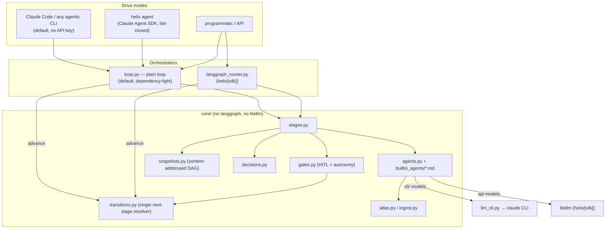
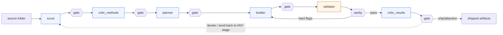

# Architecture

Helix is one pipeline core with two orchestrators over it and two ways to
drive it. The core imports with neither `langgraph` nor `litellm`.

## Layers



**Both orchestrators call the same `loop.advance`**, which calls
`core.transitions.next_stage`. They cannot diverge on routing or snapshots —
`tests/test_conformance.py` runs one scenario through both and asserts they
agree (Risk A).

## Pipeline flow



A gate runs after **every** stage. The human may proceed, send the run back
to **any** earlier stage with feedback (recorded in `state.human_feedback`
and injected into that stage's prompt), or stop. `validator` is deterministic
(no LLM); hard flags auto-route to `builder` with the flags as feedback.

## Autonomy and the cost ceiling

`autonomy_until` is one value: `""` asks at every gate, a stage name
auto-proceeds gates before it, `END` is fully autonomous. Switchable per run.
Cycling is unbounded; the only bound is a configurable cost/call ceiling
(`helix.toml [limits]`) that **pauses and snapshots** (resumable) instead of
raising — interactively it offers to continue (doubling the ceiling).

## Snapshots

Every stage and every send-back mints an immutable snapshot: stage-stamped,
deterministic, **zero LLM calls** (it reuses the decision text the stage
already produced). Artifact bytes are content-addressed under
`.helix/snapshots/<project>/objects/<sha>` (deduped), so a snapshot stays a
few KB across hundreds of cycles. Each records `parent` + `branch`, so the
history is a real DAG: list / show / diff / diagram / branch / revert /
resume-from-any. See [snapshots.md](snapshots.md).

## Storage layout

```
<project>/                 # HELIX_HOME or cwd
├── helix.toml             # [atlas].path, [limits], [default]/[lightspeed], [cli.*]
├── .helix/
│   ├── .env               # CLAUDE_CODE_OAUTH_TOKEN / API keys
│   └── snapshots/<proj>/  # <id>.json, index.json, objects/<sha>
├── atlas/                 # the persistent wiki (configurable path)
│   ├── index.md  log.md  sources/ concepts/ entities/
│   └── projects/<proj>/   # overview.md, decisions.md, .decisions.json,
│       └── artifacts/     #   timeline.md, sandbox-confined code
├── agents/<stage>.md      # optional per-project agent overrides
└── raw/<proj>/            # immutable copies of ingested input
```
