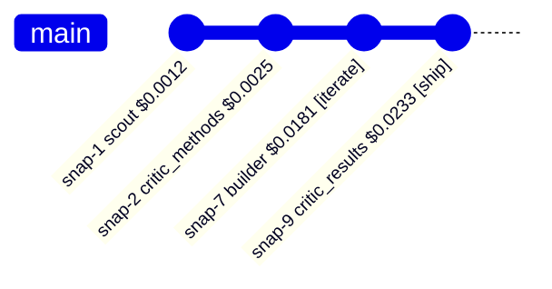

# Snapshots as Git-Style Version Control

## Goal

Use the snapshot history of a project the way you'd use `git`: browse the
timeline, inspect any point, diff two points, render a visual graph of the
project's development, and **resume the forge cycle from a chosen stage**.

## Prerequisites

- At least one pipeline run (snapshots are minted automatically during a run)

## What a Snapshot Is

Every major pipeline node — and every builder pass inside the
`builder`↔`critic_results` refine loop — appends an immutable JSON snapshot of
the **full `ForgeState`**:

```
~/.helix-mini/atlas/projects/<name>/.snapshots/
├── snap-1.json   # after scout
├── snap-2.json   # after critic_methods
└── snap-N.json   # one per stage (+ one per refine builder pass)
```

Snapshots are append-only and numbered (`snap-1`, `snap-2`, …) — like commits
on a single branch. Nothing is ever rewritten, so the history is the project's
complete development record.

## The Git Analogy

| git | helix-mini | What it does |
|-----|------------|--------------|
| `git log` | `helix-mini snapshots list <project>` | List every snapshot in order |
| `git show <ref>` | `helix-mini snapshots show <project> <N>` | Inspect one snapshot's key state |
| `git diff A B` | `helix-mini snapshots diff <project> <A> <B>` | Field-level diff of two snapshots |
| (graph in a GUI) | `helix-mini snapshots diagram <project>` | Render the history as a Mermaid `gitGraph` |
| `git checkout <ref> && <continue>` | `helix-mini snapshots resume <project> <N> --at <stage>` | Re-enter the pipeline from that state |

## Browsing the History (`list`)

```bash
helix-mini snapshots list cardiac-sim
```

```
snap-1   2026-05-17T04:33:00+00:00   scout            $0.0012  verdict=-       iters=0
snap-2   2026-05-17T04:33:05+00:00   critic_methods   $0.0025  verdict=-       iters=0
snap-7   2026-05-17T04:34:10+00:00   builder          $0.0181  verdict=iterate iters=1
snap-9   2026-05-17T04:34:55+00:00   critic_results   $0.0233  verdict=ship    iters=1
```

Snapshots are ordered numerically (so `snap-10` follows `snap-9`, not `snap-1`).
A trailing `ERROR` marks a snapshot whose state carried an error.

## Inspecting a Point (`show`)

```bash
helix-mini snapshots show cardiac-sim 7
```

```
snap-7  stage=builder  2026-05-17T04:34:10+00:00
  cost_so_far     : $0.0181
  verdict         : iterate
  build_iterations: 1
  chosen_approach : approach-2
  plan            : CFD cardiac simulation
  candidates      : 3
  artifacts       : 2
  results         : 2
  completed_stages: scout, critic_methods, planner, builder
```

## Diffing Two Points (`diff`)

A git-status-style diff: scalar fields are compared by value; list fields by
length (so the output stays readable rather than a deep dump).

```bash
helix-mini snapshots diff cardiac-sim 5 7
```

```
snap-5 -> snap-7:
  current_stage: 'planner' -> 'builder'
  build_iterations: 0 -> 1
  code_artifacts: '0 items' -> '2 items'
```

Tracked scalars: `current_stage`, `verdict`, `build_iterations`,
`cost_so_far`, `chosen_approach_id`, `next_action`, `error`. Tracked list
sizes: `candidate_approaches`, `code_artifacts`, `experiment_results`,
`critiques`, `completed_stages`, `sanity_check_flags`.

## Visualizing Development Over Time (`diagram`)

Renders the whole history as a **standard Mermaid `gitGraph`** — one commit per
snapshot, labelled with the stage, cumulative cost, and verdict. Mermaid is the
project's diagram standard, so the output renders unchanged in GitHub,
Obsidian, VS Code, and `mermaid.live`.

```bash
helix-mini snapshots diagram cardiac-sim
```



The Mermaid block is also written to a file so you can embed it in docs:

- Default: `~/.helix-mini/atlas/projects/<name>/timeline.md`
- Override with `--output path/to/file.md`

```bash
helix-mini snapshots diagram cardiac-sim --output ./cardiac-timeline.md
```

Refine loops simply appear as repeated `builder` / `critic_results` commits in
sequence — the linear history *is* the iteration record.

## Picking a Project Back Up (`resume`)

`resume` re-enters the pipeline at a stage you choose, seeded with the **full
state captured in that snapshot**. Cost and history carry forward (like
continuing from a commit); the run controls (autonomy, `--max-iterations`,
engine) are refreshed for the resumed run.

```bash
# Re-run from the snapshot's own stage:
helix-mini snapshots resume cardiac-sim 7

# Re-enter at a specific node instead:
helix-mini snapshots resume cardiac-sim 5 --at builder --lightspeed
```

```
Resuming 'cardiac-sim' at 'builder' from snap-5 (mode=lightspeed)
  [cardiac-sim] builder ($0.0181)
  [cardiac-sim] critic_results ($0.0233)

  cardiac-sim: done (stages: 6, cost: $0.0233)
```

`--at` accepts any of the 12 pipeline nodes:

```
scout  gate_scope  critic_methods  gate_methods  planner  gate_plan
builder  gate_build  validator  sanity_route  critic_results  gate_results
```

An unknown stage is rejected with the valid list. `resume` accepts the same
engine flags as `run` (`--lightspeed`, `--local`, `--local-recommended`,
`--model-size`, `--cli`, `--cli-model`, `--max-iterations`) — they share one
definition, so behavior is identical.

**Typical use:** a run shipped but you want to iterate the build further —
`resume <project> <last-snap> --at builder --max-iterations 5`. Or planning
went wrong — fix nothing, just `resume <project> <plan-snap> --at planner` to
re-plan from the captured scout/critic state without re-ingesting sources.

## Driving the Whole Flow Through Claude Code

Everything above — sourcing a folder, running scouting and the rest of the
pipeline, all snapshot operations, and resume — can be done conversationally
through an interactive Claude agent:

```bash
helix-mini agent                       # interactive session
helix-mini agent run the pipeline on ~/Documents/Research then show its timeline
```

No quotes needed — just type the request after `agent`. The agent exposes
helix-mini as in-process MCP tools:

| Tool | Gating |
|------|--------|
| `atlas_search`, `atlas_status`, `decision_log` | read-only, auto-approved |
| `snapshot_list`, `snapshot_show`, `snapshot_diff`, `snapshot_timeline` | read-only, auto-approved |
| `run_pipeline` | **gated** — terminal `y/N` confirm; denied non-interactively |
| `resume_pipeline` | **gated** — terminal `y/N` confirm; denied non-interactively |

So a full conversational session can:

1. **Source + run** — "analyze the folder ~/Documents/Research" → `run_pipeline`
   (you confirm at the terminal).
2. **Inspect** — "show me the snapshot timeline", "diff snap-5 and snap-7",
   "what was the verdict at snap-9" → read tools, no confirmation.
3. **Resume** — "pick cardiac-sim back up from snap-5 and re-run from the
   builder" → `resume_pipeline` (you confirm at the terminal).

The permission gate is **fail-closed**: only the helix tools above are ever
reachable. The SDK's built-in `Bash`/`Write`/`Edit`/… tools are both omitted
from the allow-list *and* hard-blocked, so a prompt-injected agent cannot
escape to arbitrary commands. The two expensive, state-mutating tools always
require an explicit terminal `y` and are denied outright in a non-interactive
(piped) session.

See [Driving helix-mini with a Claude Agent](claude-agent.md) for auth setup
and session details.

## Inspecting Snapshots Directly

Snapshots are plain JSON — you can always bypass the CLI:

```bash
cat ~/.helix-mini/atlas/projects/cardiac-sim/.snapshots/snap-7.json \
  | python -m json.tool
```

Each file has `timestamp`, `stage`, and `state` (the full `ForgeState` dict).
